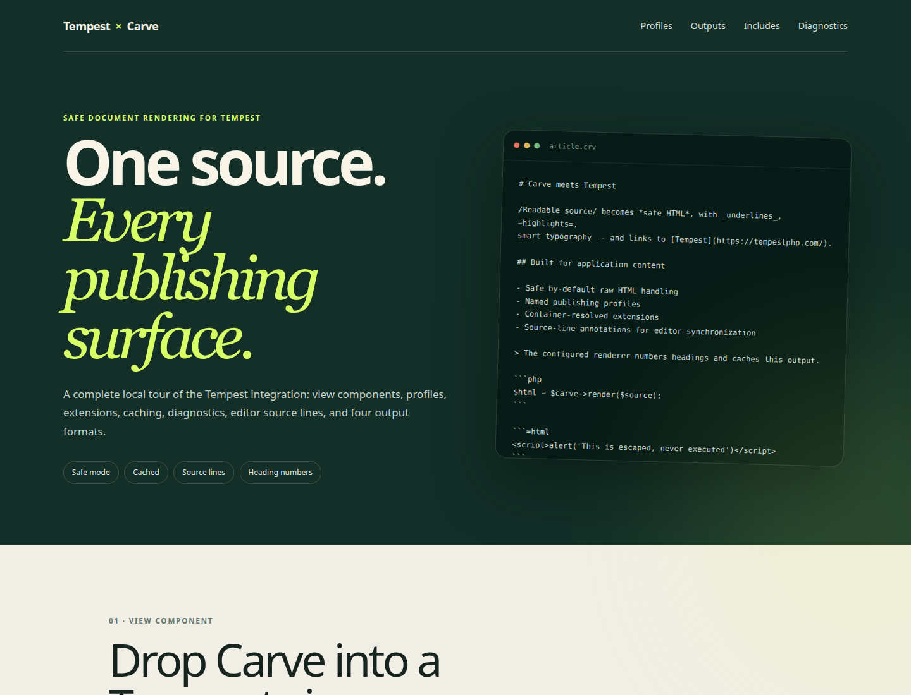

# Tempest Carve demo

A runnable Tempest application showcasing every feature of
[`markup-carve/tempest-carve`](https://github.com/markup-carve/tempest-carve).

**[View the live demo →](https://markup-carve.github.io/tempest-carve-demo/)**

## Requirements

- PHP 8.5+
- Composer
- Node.js 22+

## Installation

```sh
git clone https://github.com/markup-carve/tempest-carve-demo.git
cd tempest-carve-demo
composer install
npm ci
npm run build
php tempest serve
```

Open <http://127.0.0.1:8000>.

The `main` branch is also exported with Tempest's static-page generator and
deployed to [GitHub Pages](https://markup-carve.github.io/tempest-carve-demo/)
by GitHub Actions.



## Features

| Area | Demonstrates |
|---|---|
| View integration | Rendering through the native `<x-carve>` component |
| Profiles | Full, article, comment, and minimal policies side by side |
| Outputs | HTML, Markdown, plain text, and ANSI from one source |
| Diagnostics | Parser warnings, profile violations, and bounded render losses |
| Database-backed includes | A container-injected resolver backed by an in-memory SQLite repository, with relative nested snippets, heading shifts, dependency tracking, and revision-aware caching |
| Extensions | Container-discovered heading numbering |
| Application support | Tempest Cache and source-line annotations |
| Security | Safe raw-content handling across output targets |

Configuration lives in `app/carve.config.php`; the complete interactive showcase
is served from `/`. The include example uses `tempest-carve`'s first-class
resolver API and an in-memory SQLite database so it also works during static deployment.
Both `tempest-carve` and its include-capable `carve-php` dependency currently
track `dev-main`; the root branch alias remains necessary until the next stable
Carve PHP release.

## Quality

```sh
composer qa
npm run build
php tempest static:generate --crawl
```

## Ecosystem

Part of the [Carve ecosystem](https://github.com/markup-carve). See
[awesome-carve](https://github.com/markup-carve/awesome-carve) for integrations,
implementations, and editor tooling.
